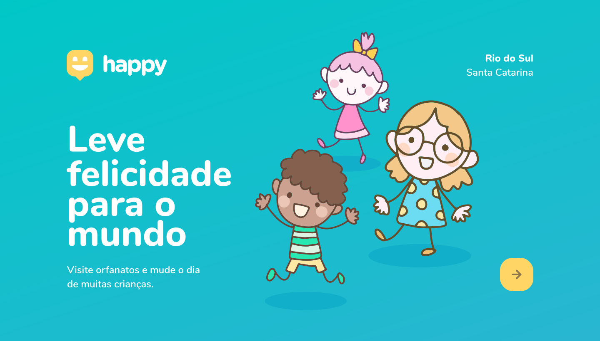

<h1 align="center">
    
</h1>

  <a href="#-tecnologias">Tecnologias</a>&nbsp;&nbsp;&nbsp;|&nbsp;&nbsp;&nbsp;
  <a href="#-projeto">Projeto</a>&nbsp;&nbsp;&nbsp;|&nbsp;&nbsp;&nbsp;
  <a href="#-layout">Layout</a>&nbsp;&nbsp;&nbsp;|&nbsp;&nbsp;&nbsp;
  <a href="#memo-licença">Licença</a>

 

  

## 🚀 Tecnologias

Esse projeto foi desenvolvido com as seguintes tecnologias:

- [Node.js](https://nodejs.org/en/)
- [Express](https://expressjs.com/pt-br/)
- [SQLite](https://www.sqlite.org/index.html)
- [Handlebars](https://handlebarsjs.com/)

## 💻 Projeto

O Happy é uma aplicação que visa trazer facilidade de se encontrar casas de acolhimento institucional para pessoas que querem fazer uma boa ação e alegrar o dia de muitas crianças.

Este é um projeto desenvolvido durante a **[Next Level Week](https://nextlevelweek.com/)**, realizada pela **[@Rocketseat](https://github.com/Rocketseat)** durante os dias 12 a 18 de Outubro de 2020.

## 🔖 Layout

Você pode visualizar o layout do projeto através [desse link](https://www.figma.com/file/mDEbnoojksG4w8sOxmudh3/Happy-Web). Lembrando que você precisa ter uma conta no [Figma](http://figma.com/) para acessá-lo.

## :memo: Licença

Esse projeto está sob a licença MIT. Veja o arquivo [LICENSE](LICENSE.md) para mais detalhes.

---

Feito por Cleverson Martins durante a **Next Level Week** com o professor [Mayk Brito](https://github.com/maykbrito) na trilha Discovery